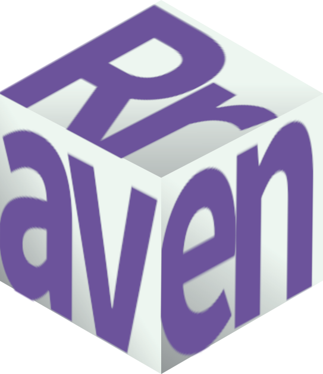

title: "Rraven: connecting R and Raven sound analysis software"
output: github_document
editor_options: 
  chunk_output_type: console
---

<!-- README.md is generated from README.Rmd. Please edit that file -->

<!-- badges: start -->
[](https://lifecycle.r-lib.org/articles/stages.html) [](https://cran.r-project.org/package=Rraven) [](https://www.repostatus.org/#active) [](https://www.gnu.org/licenses/gpl-3.0.en.html) [", "", grep("^DEPENDS", ignore.case = TRUE, readLines(con = "./DESCRIPTION"), value = TRUE), ignore.case = TRUE), ",")[[1]][1]`-6666ff.svg)](https://cran.r-project.org/) [, value = TRUE), ignore.case = TRUE)`-orange.svg?style=flat-square)](commits/develop) [)`-yellowgreen.svg)](/commits/master) [](https://cran.r-project.org/package=Rraven) [](https://cranlogs.r-pkg.org/badges/grand-total/Rraven)
<!-- badges: end -->




The `Rraven` package is designed to facilitate the exchange of data between R and  [Raven sound analysis software](https://ravensoundsoftware.com) ([Cornell Lab of Ornithology](https://www.birds.cornell.edu/home)). [Raven](https://ravensoundsoftware.com) provides very  powerful tools for the analysis of (animal) sounds. R can simplify the automatization of complex routines of analyses. Furthermore, R packages as [warbleR](https://cran.r-project.org/package=warbleR), [seewave](https://cran.r-project.org/package=seewave) and [monitoR](https://cran.r-project.org/package=monitoR) (among others) provide additional methods of analysis, working as a perfect complement for those found in [Raven](https://ravensoundsoftware.com). Hence, bridging these applications can largely expand the bioacoustician's toolkit.

Currently, most analyses in [Raven](https://ravensoundsoftware.com) cannot be run in the background from a command terminal. Thus, most `Rraven` functions are design to simplify the exchange of data between the two programs. 

Install/load the package from CRAN as follows:

```{r, eval = FALSE}

# From CRAN 
install.packages("Rraven")

#load package
library(Rraven)

```

To install the latest developmental version from [github](https://github.com/) you will need the R package [remotes](https://cran.r-project.org/package=devtools):

```{r, eval = FALSE}

# From github
remotes::install_github("maRce10/Rraven")

#load package
library(Rraven)

```

The package vignette provides detailed examples for each function in `Rraven`, including both the R code as well as the additional steps in [Raven](https://ravensoundsoftware.com) required to fully accomplished the analyses. You can pull it up as follows:

```{r, eval = FALSE}

vignette("Rraven")

```

The animations explaining additional steps in [Raven](https://ravensoundsoftware.com) are shown in more detail on the [github](https://github.com/maRce10/Rraven) version of this vignette, which can be downloaded as follows (saves the file "Rraven.github.html" in your current working directory):

```{r, eval = FALSE}

download.file(url = "https://raw.githubusercontent.com/maRce10/Rraven/master/gifs/Rraven.hitgub.html", 
destfile = "Rraven.hitgub.html")

```

The downloaded file can be opened by any internet browser.

---

Please cite `Rraven` as follows:

Araya-Salas. (2020), *Rraven: connecting R and Raven bioacoustic software*. R package version 1.0.9.
