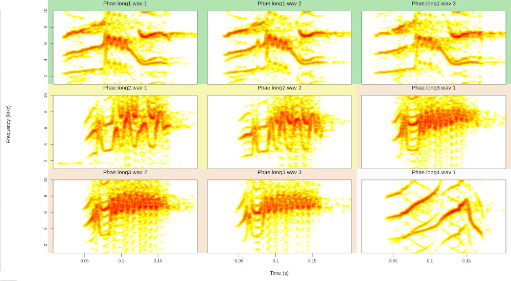

# Rraven: Connecting R and Raven Sound Analysis Software

 


The `Rraven` package is designed to facilitate the exchange of data
between R and [Raven sound analysis
software](https://www.ravensoundsoftware.com/) ([Cornell Lab of
Ornithology](https://www.birds.cornell.edu/home)).
[Raven](https://www.ravensoundsoftware.com/) provides very powerful
tools for the analysis of (animal) sounds. R can simplify the
automatization of complex routines of analyses. Furthermore, R packages
as [warbleR](https://cran.r-project.org/package=warbleR),
[seewave](https://cran.r-project.org/package=seewave) and
[monitoR](https://cran.r-project.org/package=monitoR) (among others)
provide additional methods of analysis, working as a perfect complement
for those found in [Raven](https://www.ravensoundsoftware.com/). Hence,
bridging these applications can largely expand the bioacoustician’s
toolkit.

Currently, most analyses in [Raven](https://www.ravensoundsoftware.com/)
cannot be run in the background from a command terminal. Thus, most
`Rraven` functions are design to simplify the exchange of data between
the two programs, and in some cases, export files to
[Raven](https://www.ravensoundsoftware.com/) for further analysis. This
vignette provides detailed examples for each function in `Rraven`,
including both the R code as well as the additional steps in
[Raven](https://www.ravensoundsoftware.com/) required to fully
accomplished the analyses. Raven Pro must be installed to be able to run
some of the code. Note that the animations explaining these additional
[Raven](https://www.ravensoundsoftware.com/) steps are shown in more
detail in the [github](https://github.com/maRce10/Rraven) version of
this vignette, which can be downloaded as follows (saves the file
“Rraven.github.html” in your current working directory):

``` r

download.file(
  url = "https://raw.githubusercontent.com/maRce10/Rraven/master/gifs/Rraven.hitgub.html", 
  destfile = "Rraven.github.html")
```

 

The downloaded file can be opened by any internet browser.

Before getting into the functions, the packages must be installed and
loaded. I recommend using the latest developmental version, which is
found in [github](https://github.com/maRce10/Rraven). To do so, you need
the R package [remotes](https://cran.r-project.org/package=remotes)
(which of course should be installed!). Some
[warbleR](https://cran.r-project.org/package=warbleR) functions and
example data sets will be used, so
[warbleR](https://cran.r-project.org/package=warbleR) should be
installed as well:

``` r

remotes::install_github("maRce10/warbleR")

remotes::install_github("maRce10/Rraven")

#from CRAN would be
#install.packages("warbleR")

#load packages
library(warbleR)
library(Rraven)
```

 

Let’s also use a temporary folder as the working directory in which to
save all sound files and data files:

``` r

setwd(tempdir())

#load example data
data(list = c("Phae.long1", "Phae.long2", "Phae.long3", "Phae.long4", "lbh_selec_table", "selection_files"))

#save sound files  in temporary directory
writeWave(Phae.long1, "Phae.long1.wav", extensible = FALSE)
writeWave(Phae.long2, "Phae.long2.wav", extensible = FALSE)
writeWave(Phae.long3, "Phae.long3.wav", extensible = FALSE)
writeWave(Phae.long4, "Phae.long4.wav", extensible = FALSE)

#save Raven selection tables in the temporary directory
out <- lapply(1:4, function(x)
writeLines(selection_files[[x]], con = names(selection_files)[x]))

#this is the temporary directory location (of course different each time is run)
getwd() 
```

 

------------------------------------------------------------------------

## Importing data from Raven

### *imp_raven*

This function imports [Raven](https://www.ravensoundsoftware.com/)
selection tables. Multiple files can be imported at once.
[Raven](https://www.ravensoundsoftware.com/) selection tables including
data from multiple recordings can also be imported. It returns a single
data frame with the information contained in the selection files. We
already have 2 [Raven](https://www.ravensoundsoftware.com/) selection
tables in the working directory:

``` r

list.files(path = tempdir(), pattern = "\\.txt$")
```

    [1] "LBH 1 selection table example.txt" "LBH 2 selection table example.txt" "LBH 3 selection table example.txt" "LBH 4 selection table example.txt"

 

This code shows how to import all the data contained in those files into
R:

``` r

 #providing the name of the column with the sound file names
rvn.dat <- imp_raven(all.data = TRUE, path = tempdir())

head(rvn.dat)
```

| Selection | View | Channel | Begin Time (s) | End Time (s) | Low Freq (Hz) | High Freq (Hz) | Begin File | channel | Begin Path | File Offset (s) | File Offset | selec.file |
|:--:|:--:|:--:|:--:|:--:|:--:|:--:|:--:|:--:|:--:|:--:|:--:|:--:|
| 1 | Spectrogram 1 | 1 | 1.1693549 | 1.3423884 | 2220.105 | 8604.378 | Phae.long1.wav | 1 | /tmp/RtmpWpOeaR/Phae.long1.wav | 1.1693549 | NA | LBH 1 selection table example.txt |
| 2 | Spectrogram 1 | 1 | 2.1584085 | 2.3214565 | 2169.437 | 8807.053 | Phae.long1.wav | 1 | /tmp/RtmpWpOeaR/Phae.long1.wav | 2.1584085 | NA | LBH 1 selection table example.txt |
| 3 | Spectrogram 1 | 1 | 0.3433366 | 0.5182553 | 2218.294 | 8756.604 | Phae.long1.wav | 1 | /tmp/RtmpWpOeaR/Phae.long1.wav | 0.3433366 | NA | LBH 1 selection table example.txt |
| 1 | Spectrogram 1 | 1 | 0.1595983 | 0.2921692 | 2316.862 | 8822.316 | Phae.long2.wav | 1 | /tmp/RtmpWpOeaR/Phae.long2.wav | 0.1595983 | NA | LBH 2 selection table example.txt |
| 2 | Spectrogram 1 | 1 | 1.4570585 | 1.5832087 | 2284.006 | 8888.027 | Phae.long2.wav | 1 | /tmp/RtmpWpOeaR/Phae.long2.wav | 1.4570585 | NA | LBH 2 selection table example.txt |
| 1 | Spectrogram 1 | 1 | 0.6265520 | 0.7577715 | 3006.834 | 8822.316 | Phae.long3.wav | 1 | /tmp/RtmpWpOeaR/Phae.long3.wav | NA | 0.626552 | LBH 3 selection table example.txt |

 

Note that the ‘waveform’ view data has been removed. It can also be
imported as follows (but note that the example selection tables have no
waveform data):

``` r

rvn.dat <- imp_raven(all.data = TRUE, waveform = TRUE, 
                     path = tempdir())
```

 

[Raven](https://www.ravensoundsoftware.com/) selections can also be
imported in a ‘selection.table’ format so it can be directly input into
[warbleR](https://cran.r-project.org/package=warbleR) functions. To do
this you need to set `warbler.format = TRUE`:

``` r

 #providing the name of the column with the sound file names
rvn.dat <- imp_raven(sound.file.col = "End.File", 
                     warbler.format =  TRUE, path = tempdir())

head(rvn.dat)
```

| selec | Channel | start | end | bottom.freq | top.freq | sound.files | channel | selec.file |
|:--:|:--:|:--:|:--:|:--:|:--:|:--:|:--:|:--:|
| 1 | 1 | 1.169355 | 1.342388 | 2.22011 | 8.60438 | Phae.long1.wav | 1 | LBH 1 selection table example.txt |
| 2 | 1 | 2.158408 | 2.321457 | 2.16944 | 8.80705 | Phae.long1.wav | 1 | LBH 1 selection table example.txt |
| 3 | 1 | 0.343337 | 0.518255 | 2.21829 | 8.75660 | Phae.long1.wav | 1 | LBH 1 selection table example.txt |
| 1 | 1 | 0.159598 | 0.292169 | 2.31686 | 8.82232 | Phae.long2.wav | 1 | LBH 2 selection table example.txt |
| 2 | 1 | 1.457058 | 1.583209 | 2.28401 | 8.88803 | Phae.long2.wav | 1 | LBH 2 selection table example.txt |
| 1 | 1 | 0.626552 | 0.757771 | 3.00683 | 8.82232 | Phae.long3.wav | 1 | LBH 3 selection table example.txt |

 

The data frame contains the following columns: sound.files, channel,
selec, start, end, and selec.file. You can also import the frequency
range parameters in the ‘selection.table’ by setting ‘freq.cols’ tp
`TRUE`. The data frame returned by “imp_raven” (when in the ‘warbleR’
format) can be input into several
[warbleR](https://cran.r-project.org/package=warbleR) functions for
further analysis. For instance, the following code runs additional
parameter measurements on the imported selections:

``` r

# convert to class selection.table
rvn.dat.st <- selection_table(rvn.dat, path = tempdir())

sp <- spectro_analysis(X = rvn.dat, bp = "frange", wl = 150, 
             pb = FALSE, ovlp = 90, path = tempdir())

head(sp)
```

    
[30mall selections are OK 
    
[39m

| sound.files | selec | duration | meanfreq | sd | freq.median | freq.Q25 | freq.Q75 | freq.IQR | time.median | time.Q25 | time.Q75 | time.IQR | peakt | skew | kurt | sp.ent | time.ent | entropy | sfm | meandom | mindom | maxdom | dfrange | modindx | startdom | enddom | dfslope | meanpeakf |
|:--:|:--:|:--:|:--:|:--:|:--:|:--:|:--:|:--:|:--:|:--:|:--:|:--:|:--:|:--:|:--:|:--:|:--:|:--:|:--:|:--:|:--:|:--:|:--:|:--:|:--:|:--:|:--:|:--:|
| Phae.long1.wav | 1 | 0.173033 | 5.97990 | 1.39906 | 6.32799 | 5.29380 | 6.86531 | 1.57151 | 0.076455 | 0.046568 | 0.117463 | 0.070895 | 0.060469 | 1.99941 | 7.02783 | 0.943426 | 0.886904 | 0.836729 | 0.651069 | 6.49105 | 3.825 | 8.325 | 4.50 | 7.20000 | 6.975 | 7.575 | 3.46754 | 7.125 |
| Phae.long1.wav | 2 | 0.163048 | 5.99730 | 1.42293 | 6.21213 | 5.32875 | 6.88079 | 1.55205 | 0.076655 | 0.043903 | 0.115680 | 0.071777 | 0.064809 | 1.91836 | 7.33432 | 0.946822 | 0.888565 | 0.841313 | 0.667865 | 6.71394 | 3.975 | 8.475 | 4.50 | 4.90000 | 6.825 | 7.275 | 2.75992 | 6.975 |
| Phae.long1.wav | 3 | 0.174919 | 6.01830 | 1.51485 | 6.42476 | 5.15025 | 6.97914 | 1.82890 | 0.090243 | 0.053452 | 0.127729 | 0.074277 | 0.122176 | 2.49674 | 11.14773 | 0.945084 | 0.886654 | 0.837963 | 0.671660 | 6.53271 | 2.325 | 8.625 | 6.30 | 10.30952 | 2.925 | 7.275 | 24.86869 | 7.125 |
| Phae.long2.wav | 1 | 0.132571 | 6.39830 | 1.34041 | 6.59597 | 5.60732 | 7.38085 | 1.77353 | 0.076867 | 0.054300 | 0.103665 | 0.049364 | 0.067699 | 1.56852 | 6.01639 | 0.942466 | 0.895480 | 0.843959 | 0.608618 | 6.48287 | 4.875 | 8.025 | 3.15 | 11.47619 | 4.875 | 6.225 | 10.18323 | 7.425 |
| Phae.long2.wav | 2 | 0.126150 | 6.30825 | 1.36924 | 6.59684 | 5.60584 | 7.20729 | 1.60146 | 0.076103 | 0.052849 | 0.097947 | 0.045098 | 0.064828 | 2.47090 | 10.89604 | 0.935773 | 0.897677 | 0.840022 | 0.615234 | 6.17614 | 3.075 | 7.725 | 4.65 | 9.58065 | 5.625 | 5.775 | 1.18906 | 6.675 |
| Phae.long3.wav | 1 | 0.131220 | 6.60830 | 1.09217 | 6.66533 | 6.06320 | 7.34367 | 1.28047 | 0.063505 | 0.043043 | 0.089613 | 0.046571 | 0.052921 | 1.77530 | 6.63238 | 0.930188 | 0.895888 | 0.833344 | 0.570075 | 6.75629 | 4.875 | 8.175 | 3.30 | 11.04546 | 5.475 | 8.025 | 19.43308 | 6.675 |

 

And this code creates song catalogs:

``` r

# create a color palette
trc <- function(n) terrain.colors(n = n, alpha = 0.3)

# plot catalog
catalog(X = rvn.dat.st[1:9, ], flim = c(1, 10), nrow = 3, ncol = 3, 
        same.time.scale = TRUE,  spec.mar = 1, box = FALSE,
        ovlp = 90, parallel = 1, mar = 0.01, wl = 200, 
        pal = reverse.heat.colors, width = 20,
        labels = c("sound.files", "selec"), legend = 1, 
        tag.pal = list(trc),  group.tag = "sound.files", path = tempdir())
```



------------------------------------------------------------------------

This is just to mention a few analysis that can be implemented in
[warbleR](https://cran.r-project.org/package=warbleR).

`Rraven` also contains the function `imp_syrinx` to import selections
from Syrinx sound analysis software (although this program is not been
maintained any longer).

### *extract_ts*

The function extracts parameters encoded as time series in
[Raven](https://www.ravensoundsoftware.com/) selection tables. The
resulting data frame can be directly input into functions for time
series analysis of acoustic signals as in the
[warbleR](https://cran.r-project.org/package=warbleR) function
`freq_DTW`. The function needs an R data frame, so the data should have
been previously imported using `imp_raven`. This example uses the
`selection_file.ts` example data that comes with `Rraven`:

``` r

#remove previous raven data files
unlink(list.files(pattern = "\\.txt$", path = tempdir()))

#save Raven selection table in the temporary directory
writeLines(selection_files[[5]], con = file.path(tempdir(), 
                                        names(selection_files)[5]))

rvn.dat <- imp_raven(all.data = TRUE, path = tempdir()) 

# Peak freq contour dif length
fcts <- extract_ts(X = rvn.dat, ts.column = "Peak Freq Contour (Hz)")
 
head(fcts)
```

| sound.files | selec | PFC..1 | PFC..2 | PFC..3 | PFC..4 | PFC..5 | PFC..6 | PFC..7 | PFC..8 | PFC..9 | PFC..10 | PFC..11 | PFC..12 | PFC..13 | PFC..14 | PFC..15 | PFC..16 | PFC..17 | PFC..18 | PFC..19 | PFC..20 | PFC..21 | PFC..22 | PFC..23 | PFC..24 | PFC..25 | PFC..26 | PFC..27 | PFC..28 | PFC..29 | PFC..30 | PFC..31 | PFC..32 | PFC..33 | PFC..34 | PFC..35 | PFC..36 | PFC..37 | PFC..38 | PFC..39 | PFC..40 | PFC..41 | PFC..42 | PFC..43 | PFC..44 | PFC..45 | PFC..46 | PFC..47 | PFC..48 | PFC..49 | PFC..50 | PFC..51 |
|:--:|:--:|:--:|:--:|:--:|:--:|:--:|:--:|:--:|:--:|:--:|:--:|:--:|:--:|:--:|:--:|:--:|:--:|:--:|:--:|:--:|:--:|:--:|:--:|:--:|:--:|:--:|:--:|:--:|:--:|:--:|:--:|:--:|:--:|:--:|:--:|:--:|:--:|:--:|:--:|:--:|:--:|:--:|:--:|:--:|:--:|:--:|:--:|:--:|:--:|:--:|:--:|:--:|
| Phae.long1.wav | 1 | 6943.4 | 7119.1 | 7294.9 | 7294.9 | 7294.9 | 7382.8 | 7470.7 | 7646.5 | 5185.5 | 5273.4 | 5361.3 | 5449.2 | 5449.2 | 5537.1 | 5537.1 | 5712.9 | 6416.0 | 6591.8 | 6591.8 | 5976.6 | 6503.9 | 5712.9 | 6416.0 | 6240.2 | 5976.6 | 6328.1 | 5185.5 | 5009.8 | 4658.2 | 4306.6 | 3955.1 | 7119.1 | 6855.5 | 6767.6 | 6767.6 | 6855.5 | 6943.4 | 7119.1 | 7207.0 | 7207.0 | 7207.0 | 7031.2 | 6943.4 | 6591.8 | 7119.1 | 7119.1 | 7207.0 | 7119.1 | 7207.0 | 7119.1 | 7119.1 |
| Phae.long1.wav | 2 | 6767.6 | 6943.4 | 7207.0 | 7207.0 | 7294.9 | 7382.8 | 7470.7 | 7558.6 | 7558.6 | 7646.5 | 5185.5 | 5361.3 | 5537.1 | 8261.7 | 8261.7 | 8349.6 | 5800.8 | 6152.3 | 6591.8 | 6679.7 | 5888.7 | 6416.0 | 5625.0 | 6152.3 | 5976.6 | 5976.6 | 5976.6 | 5273.4 | 5273.4 | 4570.3 | 4306.6 | 3867.2 | 7119.1 | 6855.5 | 6855.5 | 6855.5 | 6943.4 | 7119.1 | 7207.0 | 7207.0 | 7207.0 | 7207.0 | 7207.0 | 7119.1 | 7119.1 | 7207.0 | 7119.1 | 7207.0 | NA | NA | NA |
| Phae.long1.wav | 3 | 6943.4 | 4746.1 | 7119.1 | 4834.0 | 7207.0 | 4921.9 | 4921.9 | 7558.6 | 7646.5 | 7734.4 | 7998.0 | 8085.9 | 5449.2 | 8085.9 | 8349.6 | 7998.0 | 8701.2 | 6503.9 | 6591.8 | 5800.8 | 6503.9 | 6503.9 | 6328.1 | 6416.0 | 5449.2 | 6152.3 | 5361.3 | 5273.4 | 4921.9 | 4482.4 | 4130.9 | 3779.3 | 6943.4 | 6767.6 | 6767.6 | 6767.6 | 6943.4 | 7031.2 | 7119.1 | 7031.2 | 7294.9 | 7207.0 | 7207.0 | 7031.2 | 7207.0 | 7031.2 | 7031.2 | 7119.1 | 7119.1 | 7207.0 | 7119.1 |
| Phae.long2.wav | 4 | 5888.7 | 6503.9 | 4570.3 | 4834.0 | 5185.5 | 5537.1 | 5537.1 | 5800.8 | 6503.9 | 3779.3 | 6240.2 | 6328.1 | 6416.0 | 6591.8 | 5273.4 | 5712.9 | 4921.9 | 7382.8 | 6064.5 | 6767.6 | 7646.5 | 5800.8 | 7470.7 | 7294.9 | 7382.8 | 5537.1 | 6152.3 | 6416.0 | 5888.7 | 7558.6 | 7207.0 | 7294.9 | 6591.8 | 7822.3 | 7822.3 | 5976.6 | 6064.5 | 6152.3 | 6152.3 | NA | NA | NA | NA | NA | NA | NA | NA | NA | NA | NA | NA |
| Phae.long2.wav | 5 | 4570.3 | 4746.1 | 4921.9 | 5097.7 | 5097.7 | 5185.5 | 5800.8 | 5712.9 | 5888.7 | 5976.6 | 6064.5 | 6064.5 | 4570.3 | 6855.5 | 6855.5 | 5976.6 | 6855.5 | 6679.7 | 6328.1 | 7646.5 | 5712.9 | 7207.0 | 6679.7 | 6591.8 | 6240.2 | 6855.5 | 6943.4 | 6416.0 | 6943.4 | 6591.8 | 6503.9 | 6416.0 | 7558.6 | 6591.8 | 5712.9 | 6591.8 | 5537.1 | NA | NA | NA | NA | NA | NA | NA | NA | NA | NA | NA | NA | NA | NA |
| Phae.long3.wav | 6 | 4218.8 | 6240.2 | 6591.8 | 6679.7 | 7119.1 | 5009.8 | 5800.8 | 6240.2 | 6767.6 | 6416.0 | 6328.1 | 6328.1 | 6503.9 | 6679.7 | 6591.8 | 5537.1 | 6679.7 | 6679.7 | 6591.8 | 6943.4 | 5976.6 | 6591.8 | 7119.1 | 6767.6 | 7470.7 | 6416.0 | 7470.7 | 6591.8 | 7998.0 | 7119.1 | 7910.2 | 7031.2 | 6943.4 | 7470.7 | 6943.4 | 7734.4 | 7119.1 | 7822.3 | 6416.0 | 6855.5 | NA | NA | NA | NA | NA | NA | NA | NA | NA | NA | NA |

 

Note that these sequences are not all of equal length (one has NAs at
the end). `extract_ts` can also interpolate values so all time series
have the same length:

``` r

# Peak freq contour equal length
fcts <- extract_ts(X = rvn.dat, ts.column = "Peak Freq Contour (Hz)",  equal.length = TRUE)

#look at the last rows wit no NAs
head(fcts)
```

| sound.files | selec | PFC..1 | PFC..2 | PFC..3 | PFC..4 | PFC..5 | PFC..6 | PFC..7 | PFC..8 | PFC..9 | PFC..10 | PFC..11 | PFC..12 | PFC..13 | PFC..14 | PFC..15 | PFC..16 | PFC..17 | PFC..18 | PFC..19 | PFC..20 | PFC..21 | PFC..22 | PFC..23 | PFC..24 | PFC..25 | PFC..26 | PFC..27 | PFC..28 | PFC..29 | PFC..30 |
|:--:|:--:|:--:|:--:|:--:|:--:|:--:|:--:|:--:|:--:|:--:|:--:|:--:|:--:|:--:|:--:|:--:|:--:|:--:|:--:|:--:|:--:|:--:|:--:|:--:|:--:|:--:|:--:|:--:|:--:|:--:|:--:|
| Phae.long1.wav | 1 | 6943.4 | 7246.40 | 7294.90 | 7397.96 | 7628.31 | 5240.06 | 5391.61 | 5455.26 | 5537.10 | 6076.57 | 6591.80 | 5997.81 | 5958.38 | 6343.26 | 6025.08 | 5343.10 | 4803.69 | 4197.51 | 7110.01 | 6788.82 | 6810.03 | 6979.75 | 7200.94 | 7207.00 | 6997.90 | 6646.35 | 7119.10 | 7158.50 | 7182.75 | 7119.1 |
| Phae.long1.wav | 2 | 6767.6 | 7107.01 | 7228.22 | 7370.68 | 7513.13 | 7567.69 | 5864.40 | 5421.92 | 8167.75 | 8313.23 | 5873.52 | 6516.02 | 6325.11 | 6361.45 | 5988.66 | 5976.60 | 5976.60 | 5273.40 | 4524.83 | 3958.11 | 7010.02 | 6855.50 | 6913.09 | 7143.35 | 7207.00 | 7207.00 | 7194.88 | 7119.10 | 7173.66 | 7207.0 |
| Phae.long1.wav | 3 | 6943.4 | 6464.48 | 5897.76 | 4921.90 | 7285.84 | 7701.06 | 8028.31 | 5631.04 | 8295.04 | 8361.72 | 6525.12 | 5828.08 | 6503.90 | 6364.47 | 5546.18 | 5470.40 | 5067.35 | 4373.31 | 3888.41 | 6810.03 | 6767.60 | 6961.57 | 7113.04 | 7203.97 | 7207.00 | 7049.39 | 7061.51 | 7079.70 | 7143.35 | 7119.1 |
| Phae.long2.wav | 4 | 5888.7 | 5903.82 | 4733.98 | 5161.26 | 5537.10 | 5682.59 | 6406.92 | 4203.59 | 6282.63 | 6397.81 | 6455.41 | 5455.26 | 5140.11 | 7337.34 | 6306.95 | 7343.43 | 5864.44 | 7422.20 | 7346.43 | 5728.03 | 6206.86 | 6143.26 | 7270.69 | 7219.12 | 6979.72 | 7525.28 | 7695.01 | 6009.94 | 6125.05 | 6152.3 |
| Phae.long2.wav | 5 | 4570.3 | 4788.53 | 5006.77 | 5097.70 | 5182.47 | 5782.61 | 5791.71 | 5949.32 | 6058.44 | 5806.88 | 5515.90 | 6855.50 | 6067.52 | 6831.25 | 6546.33 | 7146.42 | 5979.60 | 7152.45 | 6649.39 | 6385.69 | 6749.41 | 6907.03 | 6579.68 | 6749.41 | 6522.09 | 6455.40 | 7291.90 | 6137.20 | 6379.65 | 5537.1 |
| Phae.long3.wav | 6 | 4218.8 | 6361.44 | 6652.42 | 7046.37 | 5309.83 | 6118.99 | 6743.35 | 6379.63 | 6328.10 | 6522.09 | 6640.30 | 5755.31 | 6679.70 | 6637.27 | 6882.78 | 6082.67 | 6864.54 | 6816.08 | 7252.49 | 6997.90 | 6682.72 | 7785.85 | 7582.85 | 7091.82 | 7088.86 | 7143.41 | 7707.12 | 7337.33 | 6900.93 | 6855.5 |

 

And the length of the series can also be specified:

``` r

# Peak freq contour equal length 10 measurements
fcts <- extract_ts(X = rvn.dat, ts.column = "Peak Freq Contour (Hz)",
equal.length = T, length.out = 10)  

head(fcts)
```

| sound.files | selec | PFC..1 | PFC..2 | PFC..3 | PFC..4 | PFC..5 | PFC..6 | PFC..7 | PFC..8 | PFC..9 | PFC..10 |
|:--:|:--:|:--:|:--:|:--:|:--:|:--:|:--:|:--:|:--:|:--:|:--:|
| Phae.long1.wav | 1 | 6943.4 | 7431.63 | 5449.20 | 6533.20 | 6376.93 | 4736.33 | 6767.60 | 7207.00 | 7119.10 | 7119.1 |
| Phae.long1.wav | 2 | 6767.6 | 7402.33 | 5263.63 | 6650.40 | 6357.41 | 5898.47 | 4951.17 | 7041.01 | 7207.00 | 7207.0 |
| Phae.long1.wav | 3 | 6943.4 | 4921.90 | 7792.93 | 7236.33 | 6347.63 | 5000.01 | 6767.60 | 7040.97 | 7128.87 | 7119.1 |
| Phae.long2.wav | 4 | 5888.7 | 5263.63 | 5292.97 | 6533.20 | 7109.37 | 5986.34 | 5742.17 | 7363.27 | 7822.30 | 6152.3 |
| Phae.long2.wav | 5 | 4570.3 | 5097.70 | 5888.70 | 4570.30 | 6855.50 | 5712.90 | 6240.20 | 6943.40 | 7558.60 | 5537.1 |
| Phae.long3.wav | 6 | 4218.8 | 6416.00 | 6533.20 | 6679.70 | 6650.40 | 6943.33 | 7470.70 | 7617.20 | 7470.73 | 6855.5 |

 

The time series data frame can be directly input into the `freq_DTW`
[warbleR](https://cran.r-project.org/package=warbleR) function to
calculate [Dynamic Time
Warping](https://en.wikipedia.org/wiki/Dynamic_time_warping) distances:

``` r

freq_DTW(ts.df = fcts, path = tempdir())
```

 

    calculating DTW distances, no progress bar ...

|  | Phae.long1.wav-1 | Phae.long1.wav-2 | Phae.long1.wav-3 | Phae.long2.wav-4 | Phae.long2.wav-5 | Phae.long3.wav-6 | Phae.long3.wav-7 | Phae.long3.wav-8 | Phae.long4.wav-9 | Phae.long4.wav-10 | Phae.long4.wav-11 |
|:---|:--:|:--:|:--:|:--:|:--:|:--:|:--:|:--:|:--:|:--:|:--:|
| Phae.long1.wav-1 | 0.00 | 2509.73 | 5702.99 | 9541.19 | 12411.93 | 9648.40 | 7207.00 | 7343.82 | 13740.28 | 11455.40 | 14970.64 |
| Phae.long1.wav-2 | 2509.73 | 0.00 | 5624.78 | 7334.11 | 12333.71 | 10058.78 | 7255.63 | 7734.49 | 14257.91 | 10908.22 | 15107.31 |
| Phae.long1.wav-3 | 5702.99 | 5624.78 | 0.00 | 10615.03 | 11620.86 | 11044.99 | 8046.64 | 7675.46 | 15077.77 | 13476.38 | 14696.92 |
| Phae.long2.wav-4 | 9541.19 | 7334.11 | 10615.03 | 0.00 | 7665.76 | 9111.46 | 7587.78 | 7109.27 | 11318.26 | 10683.49 | 11572.13 |
| Phae.long2.wav-5 | 12411.93 | 12333.71 | 11620.86 | 7665.76 | 0.00 | 8466.93 | 9160.36 | 8339.72 | 10839.78 | 13535.00 | 9902.21 |
| Phae.long3.wav-6 | 9648.40 | 10058.78 | 11044.99 | 9111.46 | 8466.93 | 0.00 | 6464.63 | 6425.53 | 16122.97 | 15234.57 | 14413.98 |
| Phae.long3.wav-7 | 7207.00 | 7255.63 | 8046.64 | 7587.78 | 9160.36 | 6464.63 | 0.00 | 4882.82 | 13144.40 | 11689.30 | 13095.31 |
| Phae.long3.wav-8 | 7343.82 | 7734.49 | 7675.46 | 7109.27 | 8339.72 | 6425.53 | 4882.82 | 0.00 | 13711.03 | 13144.48 | 13515.51 |
| Phae.long4.wav-9 | 13740.28 | 14257.91 | 15077.77 | 11318.26 | 10839.78 | 16122.97 | 13144.40 | 13711.03 | 0.00 | 10517.49 | 9424.16 |
| Phae.long4.wav-10 | 11455.40 | 10908.22 | 13476.38 | 10683.49 | 13535.00 | 15234.57 | 11689.30 | 13144.48 | 10517.49 | 0.00 | 9725.81 |
| Phae.long4.wav-11 | 14970.64 | 15107.31 | 14696.92 | 11572.13 | 9902.21 | 14413.98 | 13095.31 | 13515.51 | 9424.16 | 9725.81 | 0.00 |

------------------------------------------------------------------------

### *relabel_colms*

This is a simple function to relabel columns so they match the selection
table format used in
[warbleR](https://cran.r-project.org/package=warbleR):

``` r

#to simplify the example select a subset of the columns 
st1 <- rvn.dat[ ,1:7]

#check original column names
st1
```

``` r

# Relabel the basic columns required by warbleR
relabel_colms(st1)
```

 

Additional columns can also be relabeled:

``` r

# 2 additional column 
relabel_colms(st1, extra.cols.name = "View",
              extra.cols.new.name = "Raven view")
```

| selec |  Raven view   | Channel | start |   end    | bottom.freq | top.freq |
|:-----:|:-------------:|:-------:|:-----:|:--------:|:-----------:|:--------:|
|   1   | Spectrogram 1 |    1    | 1.169 | 1.342033 |   2220.1    |  8604.4  |
|   2   | Spectrogram 1 |    1    | 2.158 | 2.321048 |   2169.4    |  8807.1  |
|   3   | Spectrogram 1 |    1    | 0.343 | 0.517919 |   2218.3    |  8756.6  |
|   4   | Spectrogram 1 |    1    | 0.160 | 0.292571 |   2316.9    |  8822.3  |
|   5   | Spectrogram 1 |    1    | 1.457 | 1.583150 |   2284.0    |  8888.0  |
|   6   | Spectrogram 1 |    1    | 0.627 | 0.758220 |   3006.8    |  8822.3  |
|   7   | Spectrogram 1 |    1    | 1.974 | 2.104179 |   2776.8    |  8888.0  |
|   8   | Spectrogram 1 |    1    | 0.123 | 0.254217 |   2316.9    |  9315.2  |
|   9   | Spectrogram 1 |    1    | 1.517 | 1.662425 |   2514.0    |  9216.6  |
|  10   | Spectrogram 1 |    1    | 2.933 | 3.077186 |   2579.7    | 10235.1  |
|  11   | Spectrogram 1 |    1    | 0.145 | 0.290099 |   2579.7    |  9742.3  |

 

------------------------------------------------------------------------

### *imp_corr_mat*

The function imports the output of a batch correlation routine in
[Raven](https://www.ravensoundsoftware.com/). Both the correlation and
lag matrices contained in the output ‘.txt’ file are read and both
waveform and spectrogram (cross-correlation) correlations can be
imported.

This example shows how to input the sound files into
[Raven](https://www.ravensoundsoftware.com/) and how to bring the
results back to R. First, the selections need to be cut as single sound
files for the [Raven](https://www.ravensoundsoftware.com/) correlator to
be able to read it. We can do this using the `cut_sels` function from
[warbleR](https://cran.r-project.org/package=warbleR):

``` r

#create new folder to put cuts
dir.create(file.path(tempdir(), "cuts"))

# add a rowname column to be able to match cuts and selections
lbh_selec_table$rownames <- sprintf("%02d",1:nrow(lbh_selec_table))

# cut files
cut_sels(X = lbh_selec_table, mar = 0.05, path = tempdir(), dest.path = 
           file.path(tempdir(), "cuts"), 
         labels = c("rownames", "sound.files", "selec"), pb = FALSE)

#list cuts
list.files(path = file.path(tempdir(), "cuts"))
```

 

Every selection is in its own sound file (labeled as
`paste("rownames", "sound.files", "selec")`). Now open
[Raven](https://www.ravensoundsoftware.com/) and run the batch
correlator on the ‘cuts’ folder as follows:


 

And then import the output file into R:

``` r

# Import output (change the name of the file if you used a different one)
xcorr.rav <- imp_corr_mat(file = "BatchCorrOutput.txt", path = tempdir())
```

 

The function returns a list containing the correlation matrix:

``` r

xcorr.rav$correlation
```

 

|  | 01-Phae.long1-1.wav | 10-Phae.long4-2.wav | 11-Phae.long4-3.wav | 07-Phae.long3-2.wav | 05-Phae.long2-2.wav | 09-Phae.long4-1.wav | 04-Phae.long2-1.wav | 02-Phae.long1-2.wav | 06-Phae.long3-1.wav | 03-Phae.long1-3.wav | 08-Phae.long3-3.wav |
|:---|:--:|:--:|:--:|:--:|:--:|:--:|:--:|:--:|:--:|:--:|:--:|
| 01-Phae.long1-1.wav | 1.000 | 0.216 | 0.184 | 0.285 | 0.443 | 0.195 | 0.145 | 0.613 | 0.360 | 0.812 | 0.236 |
| 10-Phae.long4-2.wav | 0.216 | 1.000 | 0.781 | 0.290 | 0.235 | 0.907 | 0.289 | 0.176 | 0.204 | 0.209 | 0.323 |
| 11-Phae.long4-3.wav | 0.184 | 0.781 | 1.000 | 0.279 | 0.186 | 0.804 | 0.274 | 0.127 | 0.189 | 0.185 | 0.393 |
| 07-Phae.long3-2.wav | 0.285 | 0.290 | 0.279 | 1.000 | 0.433 | 0.281 | 0.270 | 0.251 | 0.635 | 0.274 | 0.496 |
| 05-Phae.long2-2.wav | 0.443 | 0.235 | 0.186 | 0.433 | 1.000 | 0.197 | 0.243 | 0.449 | 0.397 | 0.363 | 0.304 |
| 09-Phae.long4-1.wav | 0.195 | 0.907 | 0.804 | 0.281 | 0.197 | 1.000 | 0.310 | 0.164 | 0.199 | 0.214 | 0.322 |
| 04-Phae.long2-1.wav | 0.145 | 0.289 | 0.274 | 0.270 | 0.243 | 0.310 | 1.000 | 0.151 | 0.302 | 0.182 | 0.256 |
| 02-Phae.long1-2.wav | 0.613 | 0.176 | 0.127 | 0.251 | 0.449 | 0.164 | 0.151 | 1.000 | 0.264 | 0.448 | 0.200 |
| 06-Phae.long3-1.wav | 0.360 | 0.204 | 0.189 | 0.635 | 0.397 | 0.199 | 0.302 | 0.264 | 1.000 | 0.318 | 0.377 |
| 03-Phae.long1-3.wav | 0.812 | 0.209 | 0.185 | 0.274 | 0.363 | 0.214 | 0.182 | 0.448 | 0.318 | 1.000 | 0.227 |
| 08-Phae.long3-3.wav | 0.236 | 0.323 | 0.393 | 0.496 | 0.304 | 0.322 | 0.256 | 0.200 | 0.377 | 0.227 | 1.000 |

 

and the time lag matrix:

``` r

xcorr.rav$`lag (s)`
```

 

|  | 01-Phae.long1-1.wav | 10-Phae.long4-2.wav | 11-Phae.long4-3.wav | 07-Phae.long3-2.wav | 05-Phae.long2-2.wav | 09-Phae.long4-1.wav | 04-Phae.long2-1.wav | 02-Phae.long1-2.wav | 06-Phae.long3-1.wav | 03-Phae.long1-3.wav | 08-Phae.long3-3.wav |
|:---|:--:|:--:|:--:|:--:|:--:|:--:|:--:|:--:|:--:|:--:|:--:|
| 01-Phae.long1-1.wav | 0.000 | 0.011 | 0.006 | 0.028 | 0.034 | 0.006 | 0.023 | 0.000 | 0.023 | -0.006 | 0.023 |
| 10-Phae.long4-2.wav | -0.011 | 0.000 | -0.006 | 0.040 | 0.023 | -0.006 | -0.028 | -0.017 | 0.040 | -0.017 | 0.057 |
| 11-Phae.long4-3.wav | -0.006 | 0.006 | 0.000 | 0.046 | 0.028 | 0.000 | -0.023 | -0.074 | 0.046 | -0.011 | 0.063 |
| 07-Phae.long3-2.wav | -0.028 | -0.040 | -0.046 | 0.000 | -0.011 | -0.046 | -0.023 | -0.034 | 0.000 | -0.028 | 0.017 |
| 05-Phae.long2-2.wav | -0.034 | -0.023 | -0.028 | 0.011 | 0.000 | -0.028 | 0.017 | -0.028 | 0.023 | -0.040 | 0.006 |
| 09-Phae.long4-1.wav | -0.006 | 0.006 | 0.000 | 0.046 | 0.028 | 0.000 | -0.023 | 0.034 | 0.046 | -0.011 | 0.063 |
| 04-Phae.long2-1.wav | -0.023 | 0.028 | 0.023 | 0.023 | -0.017 | 0.023 | 0.000 | -0.057 | 0.057 | -0.051 | 0.017 |
| 02-Phae.long1-2.wav | 0.000 | 0.017 | 0.074 | 0.034 | 0.028 | -0.034 | 0.057 | 0.000 | 0.040 | 0.000 | 0.023 |
| 06-Phae.long3-1.wav | -0.023 | -0.040 | -0.046 | 0.000 | -0.023 | -0.046 | -0.057 | -0.040 | 0.000 | -0.028 | 0.000 |
| 03-Phae.long1-3.wav | 0.006 | 0.017 | 0.011 | 0.028 | 0.040 | 0.011 | 0.051 | 0.000 | 0.028 | 0.000 | 0.023 |
| 08-Phae.long3-3.wav | -0.023 | -0.057 | -0.063 | -0.017 | -0.006 | -0.063 | -0.017 | -0.023 | 0.000 | -0.023 | 0.000 |

 

This output is ready for stats. For instance, the following code runs a
mantel test between cross-correlation (converted to distances) and
[warbleR](https://cran.r-project.org/package=warbleR) spectral parameter
pairwise dissimilarities:

``` r

#convert cross-corr to distance
xcorr.rvn <- 1- xcorr.rav$correlation

#sort matrix to match selection table
xcorr.rvn <- xcorr.rvn[order(rownames(xcorr.rvn)), order(colnames(xcorr.rvn))]

#convert it to distance matrix
xcorr.rvn <- as.dist(xcorr.rvn)

# measure acoustic parameters
sp.wrblR <- spectro_analysis(lbh_selec_table, bp = c(1, 11), wl = 150, 
                   pb = FALSE, path = tempdir())

#convert them to distance matrix
dist.sp.wrblR <- dist(sp.wrblR)
```

    Warning in dist(sp.wrblR): NAs introduced by coercion

``` r

vegan::mantel(xcorr.rvn, dist.sp.wrblR)
```


    Mantel statistic based on Pearson's product-moment correlation 

    Call:
    vegan::mantel(xdis = xcorr.rvn, ydis = dist.sp.wrblR) 

    Mantel statistic r: 0.259 
          Significance: 0.021 

    Upper quantiles of permutations (null model):
      90%   95% 97.5%   99% 
    0.134 0.181 0.232 0.300 
    Permutation: free
    Number of permutations: 999

 

There is actually a good match between the two methods!

------------------------------------------------------------------------

## Exporting R data to Raven

### *exp_raven*

*exp_raven* saves a selection table in ‘.txt’ format that can be
directly opened in Raven. No objects are returned into the R
environment. The following code exports a data table from a single sound
file:

``` r

# Select data for a single sound file
st1 <- lbh_selec_table[lbh_selec_table$sound.files == "Phae.long1.wav", ]

# Export data of a single sound file
exp_raven(st1, file.name = "Phaethornis 1", khz.to.hz = TRUE, path = tempdir())
```

 

If the path to the sound file is provided, the functions exports a
‘sound selection table’ which can be directly open by
[Raven](https://www.ravensoundsoftware.com/) (and which will also open
the associated sound file):

``` r

# Select data for a single sound file
st1 <- lbh_selec_table[lbh_selec_table$sound.files == "Phae.long1.wav",]

# Export data of a single sound file
exp_raven(st1, file.name = "Phaethornis 1", khz.to.hz = TRUE,
          sound.file.path = tempdir(), path = tempdir())
```


 

This is useful to add new selections or even new measurements:


 

If several sound files are available, users can either export them as a
single selection file or as multiple selection files (one for each sound
file). This example creates a multiple sound file selection:

``` r

exp_raven(X = lbh_selec_table, file.name = "Phaethornis multiple sound files", 
          sound.file.path = tempdir(), single.file = TRUE, path = tempdir())
```

 

These type of tables can be opened as a multiple file display in
[Raven](https://www.ravensoundsoftware.com/).

------------------------------------------------------------------------

## Running Raven from R

Functions to run Raven from R only work on Raven Pro 1.5 or earlier
versions.

### *run_raven*

The function opens multiple sound files simultaneously in
[Raven](https://www.ravensoundsoftware.com/). When the analysis is
finished (and the [Raven](https://www.ravensoundsoftware.com/) window is
closed) the data can be automatically imported back into R using the
‘import’ argument. Note that
[Raven](https://www.ravensoundsoftware.com/), unlike R, can also handle
files in ‘mp3’, ‘flac’ and ‘aif’ format .

``` r

# here replace with the path where Raven is install in your computer
raven.path <- "PATH_TO_RAVEN_DIRECTORY_HERE" 

# run function 
run_raven(raven.path = raven.path, sound.files = c("Phae.long1.wav", "Phae.long2.wav", "Phae.long3.wav", "Phae.long4.wav"), 
          import = TRUE, all.data = TRUE, path = tempdir())  
```


 

See `imp_raven` above for more details on additional settings when
importing selections.

------------------------------------------------------------------------

### *raven_batch_detec*

As the name suggests, *raven_batch_detec* runs
[Raven](https://www.ravensoundsoftware.com/) detector on multiple sound
files (sequentially). Batch detection in
[Raven](https://www.ravensoundsoftware.com/) can also take files in
‘mp3’, ‘flac’ and ‘aif’ format (although this could not be further
analyzed in R!).

This is example runs the detector on one of the example sound files that
comes by default with [Raven](https://www.ravensoundsoftware.com/):

``` r

detec.res <- raven_batch_detec(raven.path = raven.path, 
                               sound.files = "BlackCappedVireo.aif",
                               path = file.path(raven.path, "Examples"))
```


 

------------------------------------------------------------------------

Please report any bugs [here](https://github.com/maRce10/Rraven/issues).
The `Rraven` package should be cited as follows:

Araya-Salas, M. (2017), *Rraven: connecting R and Raven bioacoustic
software*. R package version 1.0.0.

------------------------------------------------------------------------

Session information

    R version 4.6.1 (2026-06-24)
    Platform: x86_64-pc-linux-gnu
    Running under: Ubuntu 24.04.4 LTS

    Matrix products: default
    BLAS:   /usr/lib/x86_64-linux-gnu/openblas-pthread/libblas.so.3 
    LAPACK: /usr/lib/x86_64-linux-gnu/openblas-pthread/libopenblasp-r0.3.26.so;  LAPACK version 3.12.0

    locale:
     [1] LC_CTYPE=C.UTF-8       LC_NUMERIC=C           LC_TIME=C.UTF-8        LC_COLLATE=C.UTF-8     LC_MONETARY=C.UTF-8    LC_MESSAGES=C.UTF-8   
     [7] LC_PAPER=C.UTF-8       LC_NAME=C              LC_ADDRESS=C           LC_TELEPHONE=C         LC_MEASUREMENT=C.UTF-8 LC_IDENTIFICATION=C   

    time zone: UTC
    tzcode source: system (glibc)

    attached base packages:
    [1] stats     graphics  grDevices utils     datasets  methods   base     

    other attached packages:
    [1] kableExtra_1.4.1   Rraven_1.0.16      warbleR_1.1.37     NatureSounds_1.0.5 knitr_1.51         seewave_2.2.4      tuneR_1.4.7       

    loaded via a namespace (and not attached):
     [1] sass_0.4.10        xml2_1.6.0         bitops_1.0-9       lattice_0.22-9     stringi_1.8.7      digest_0.6.39      magrittr_2.0.5    
     [8] grid_4.6.1         evaluate_1.0.5     RColorBrewer_1.1-3 fastmap_1.2.0      Matrix_1.7-5       jsonlite_2.0.0     brio_1.1.5        
    [15] mgcv_1.9-4         httr_1.4.8         viridisLite_0.4.3  scales_1.4.0       permute_0.9-10     pbapply_1.7-4      textshaping_1.0.5 
    [22] jquerylib_0.1.4    cli_3.6.6          rlang_1.3.0        fftw_1.0-9         splines_4.6.1      cachem_1.1.0       yaml_2.3.12       
    [29] vegan_2.7-5        otel_0.2.0         tools_4.6.1        parallel_4.6.1     curl_7.1.0         vctrs_0.7.3        R6_2.6.1          
    [36] proxy_0.4-29       lifecycle_1.0.5    dtw_1.23-3         stringr_1.6.0      fs_2.1.0           MASS_7.3-65        cluster_2.1.8.2   
    [43] ragg_1.5.2         desc_1.4.3         pkgdown_2.2.1      bslib_0.11.0       glue_1.8.1         Rcpp_1.1.2         systemfonts_1.3.2 
    [50] xfun_0.60          rstudioapi_0.19.0  farver_2.1.2       rjson_0.2.23       nlme_3.1-169       htmltools_0.5.9    rmarkdown_2.31    
    [57] svglite_2.2.2      testthat_3.3.2     signal_1.8-1       compiler_4.6.1     RCurl_1.98-1.19   
